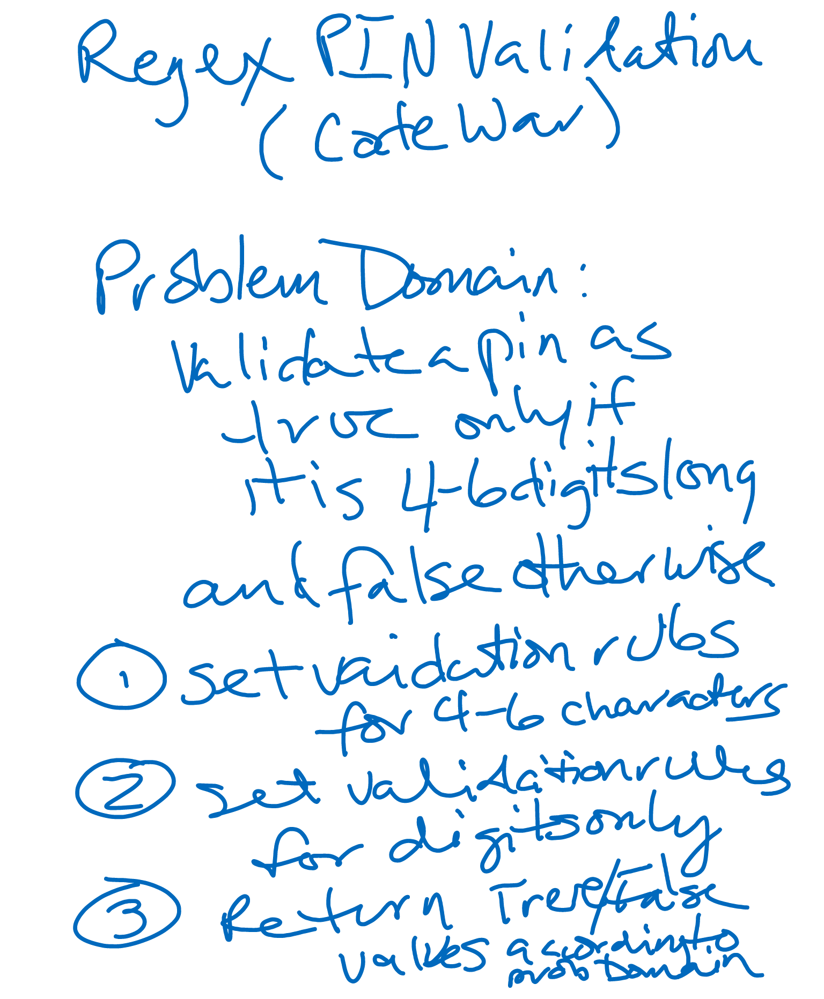

# CodeWars-301
*Pin Code Validation with Regex - Kata 4 Day 4*

**Link to Kata:** 
https://www.codewars.com/kata/regex-validate-pin-code

**Problem Domain:** This code is meant to validate a PIN that is between 4 to 6 digits only that returns a TRUE if it the content meets those parameters and FALSE if not. 

**Thought process for solution:**

This time I pseudo coded on my own.

I believe the best approach is to rules to do the following:
* make sure the string was between 4 and 6 characters
* make sure that the string containes only digits
* make sure that only false and true messages are returned based on the validigyt of the PIN (re length and digits-only use)

**Solution work:**
1. Made solutions.js

2. Made README

3. Tested my solution in Kata and can only get it work for digit quantity match (4 or 6). 

4. Coming back to this fresh, I could tell I was close, so I kept trying different things with the brackets and braces, based on the hint I got from TA Shannon. 

5. Finally got it!!

**Source for image MD code**: http://www.disturbancesinthewash.net/journal/2012/8/11/how-to-add-an-image-with-link-in-markdown.html

**Source for RegEx help**:
https://regex101.com/
