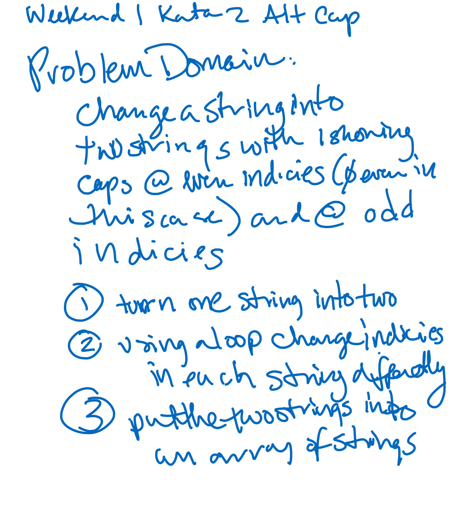

# CodeWars-301
* Alt Cap - Kata 7 Weekend 1*

**Link to Kata:** 
https://www.codewars.com/kata/alternate-capitalization 

**Problem Domain:** This code is meant to capitalize the letters that occupy even indexes and odd indexes separately in a string and return as shown below. Index 0 will be considered even.

For example, capitalize("abcdef") = ['AbCdEf', 'aBcDeF']. 

The input will be a lowercase string with no spaces.

**Thought process for solution:**

This time I pseudo coded on my own.

I believe the best approach is to rules to do the following:
* duplicate the intial string
* use some kind of loop approach to change the caps in each string as outlined in the problem domain 
* put the two changed strings into an array

**Solution work:**
1. Made solutions.js

2. Made README

3. Tested a .even/.odd method that I apparently made up then .toUpperCase  neither of which worked on the strings with the array I created...Half way there and too tired to finish. Spent about 35 minutes on this.  Completing now so assignment is turned in and will come back to this.

**Source for image MD code**: http://www.disturbancesinthewash.net/journal/2012/8/11/how-to-add-an-image-with-link-in-markdown.html

**Source for RegEx help**:
https://regex101.com/
