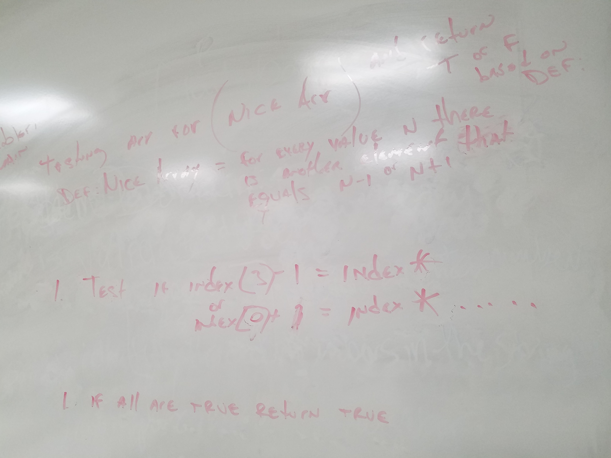

# CodeWars-301
*Find the "Nice" array- Kata 9 Day 6*

**Link to Kata:** https://www.codewars.com/kata/fixme-replace-all-dots

**Problem Domain:** Identify a "Nice Array" with true and something not nice as false. The "Nice Array" is defined and any element(n) in the array having another element that is n-1 OR n+1. Anything else in an array is not nice and needs to return false, including an empty array.

**Thought process for solution:**

Tonight I pseudo coded on with Jose R. 

1. Test if the 0 index in the array meets the conditions =n+1 or =n-1 for any other element in the array.

2. Repeat test for each element in the array.

3. If all indicies meet the conditions in #1 return true, otherwise false.

**Solution work:**
1. Made README

2. Made solutions.js

3. Review psuedo code and array methods.

4. Tried several array prototype methods like .every and .each but, after chatting with both Beverly and Haron, tried .includes (way easier)

5. Tested and only partially passed - didn't correctly configure to test for empty array

6. Reset my test for the array as part of my conditional for true as a "not equal" to empty array along with array index includes +1 and -1 Partially passed

7. After talking with Haron, also tried using a global "returnArray" to store and return either true or false. It too partially passed, but I also didn't like having to create a new array to return the value.

8. Then I remembered there was a way to continue a loop (return ends it), but could remember the command then I found "continue" (I don't remember it from 201, but I'm sure we covered it) on W3 schools and AHA!

9. Code passed sample test fully (that was true for two prior solutions) and then passed full attempt.

10. Checked files and submitted. 

**Source for image MD code**: http://www.disturbancesinthewash.net/journal/2012/8/11/how-to-add-an-image-with-link-in-markdown.html

**Source for for loop help**:
https://www.w3schools.com/jsref/jsref_continue.asp
