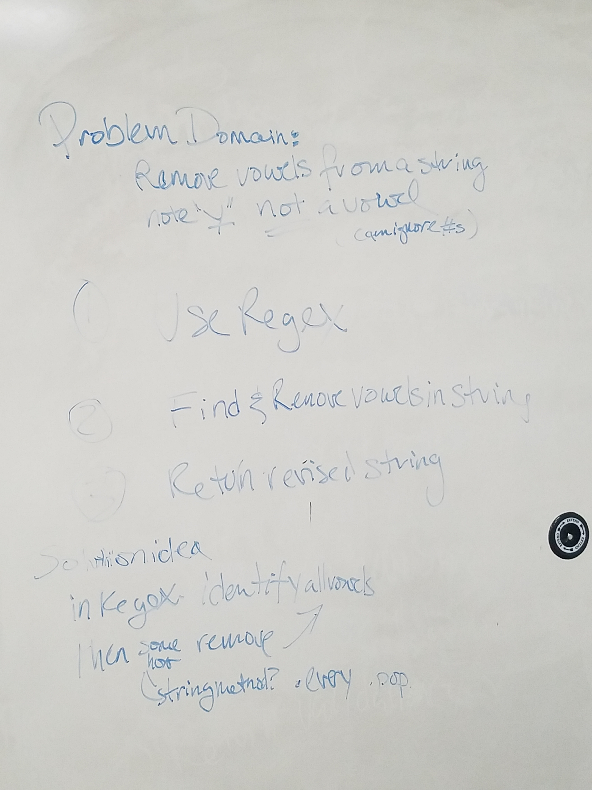

# CodeWars-301
*Disemvowel - Kata 7 Day 11*

**Link to Kata:** 
https://www.codewars.com/kata/disemvowel-trolls/train/javascript

**Problem Domain:** This code is meant to remove all vowels from troll comments on a site (not including y).

**Thought process for solution:**

This time I pseudcoded with Rebecca Prowse

We discussed the steps first
* identify the vowels in a string
* remove or replace those vowels with null

Then we discussed how we might write the solution
* We agreed RegEx would likely be simiplist and I suggested there might be a string prototype method that would help

**Solution work:**
1. Made solutions.js

2. Made README

3. Found the .replace method for a string as a RegEx expression

4. Tested the regex expression I was thinking of in regex1001.com

5. Tried it in the kata - had an error with spaces and not needing the "^ and $" at the start and end of the regex, respectively

6. It worked and took us less than 10 minutes to do. A MIRACLE!

**Source for image MD code**: http://www.disturbancesinthewash.net/journal/2012/8/11/how-to-add-an-image-with-link-in-markdown.html

**Source for RegEx help**:
https://regex101.com/

**Source for regular expressions and related methods**
https://developer.mozilla.org/en-US/docs/Web/JavaScript/Guide/Regular_Expressions
