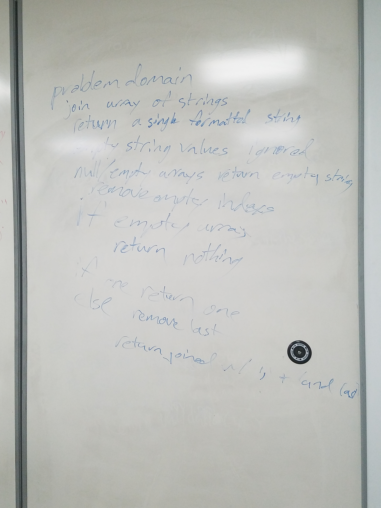

# CodeWars-301
*String Sentence - Kata 12 Day 8*

**Link to Kata:** 
https://www.codewars.com/kata/disemvowel-trolls/train/javascript

**Problem Domain:** This code is meant to remove all vowels from troll comments on a site (not including y).

**Thought process for solution:**

This time I pseudcoded with Austin Matteson

We discussed the steps first, and Austin writes the pseudo code ever so slightly different than I do, but I found it really much better to code from...instead of numbering steps he wrote steps out with a conditional/code like prompt. 

Then we discussed how we might write the solution
* We agreed array methods like filter, map, pop or shift might be useful.

**Solution work:**
1. Made solutions.js

2. Made README

3. Worked on this on my own, using REPL and a single test I made up. 

4. I tried .map, but I don't understand it well enough. 

5. I researched .join and got a refresher on .pop, so then I applied those, but I was failing most of the test still 

6. Austin returned from his whiteboard, solved it in less than 3 minutes and then pair programmed with me, asking me leading questions and letting me come up with solutions on my own to solve the failed test conditions. 

7. Finally solved it and passed all tests. Austin was really patient and helpful. 

**Source for image MD code**: http://www.disturbancesinthewash.net/journal/2012/8/11/how-to-add-an-image-with-link-in-markdown.html

**Source for array methods information, W3Schools** https://www.w3schools.com/jsref/jsref_filter.asp 
