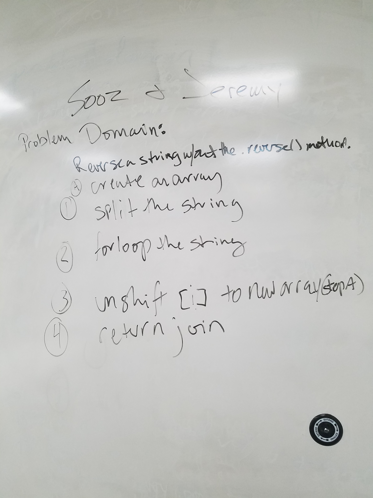

# CodeWars-301
*String Sentence - Kata 13 Day 9*

**Link to Kata:** 
https://www.codewars.com/kata/reversed-strings/train/javascript

**Problem Domain:** This code is meant to reverse a string and we're not allowed to use .reverse method.

**Thought process for solution:**

This time I pseudcoded with Jeremy Crawford

We discussed the steps with code.  

Then we discussed how we might write the solution
* We agreed array methods like unshift, join and a forloop

**Solution work:**
1. Made solutions.js

2. Made README

3. Wl. 

**Source for image MD code**: http://www.disturbancesinthewash.net/journal/2012/8/11/how-to-add-an-image-with-link-in-markdown.html

**Source for array methods information, W3Schools** https://www.w3schools.com/jsref/jsref_filter.asp 

**Source for unshift method from MDN**
https://developer.mozilla.org/en-US/docs/Web/JavaScript/Reference/Global_Objects/Array/unshift
