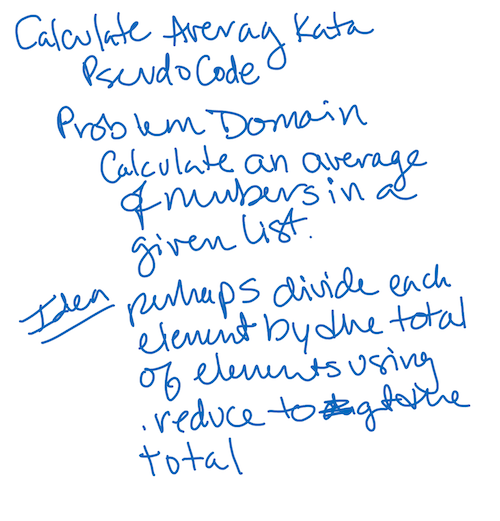

# CodeWars-301
*Calculate Average - Kata 15 Day 10*

**Link to Kata:** 
https://www.codewars.com/kata/calculate-average/train/javascript

**Problem Domain:** This code is meant to calculate the average of numbers in an array.

**Thought process for solution:**

This time I pseudcoded alone

I figured if I could use reduce to total the array and then divide by the length of the array that should work.

**Solution work:**
1. Made solutions.js

2. Made README

3. Reviewed my class REPL on reduce (https://repl.it/@CodeMaven/REDUCE-CF-301)

4. Applied structure of code to this problem and SOLVED!

**Source for image MD code**: http://www.disturbancesinthewash.net/journal/2012/8/11/how-to-add-an-image-with-link-in-markdown.html

**Source for array methods information, W3Schools** https://www.w3schools.com/jsref/jsref_filter.asp 
