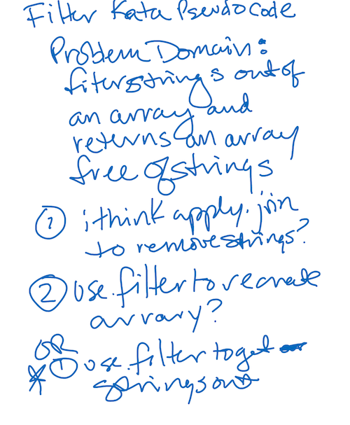

# CodeWars-301
*Filter Strings - Kata 14 Day 10*

**Link to Kata:** 
https://www.codewars.com/kata/list-filtering/train/javascript

**Problem Domain:** This code is meant to remove any strings from an array that also includes integers.

**Thought process for solution:**

This time I pseudcoded alone

I thought about using .join but it turned the array  and then filter or just use filter alone.  

**Solution work:**
1. Made solutions.js

2. Made README

3. I tried using .join method, but realized it would just create a string I'd have to turn back into array. Seemed realy inefficient. 

4. I tried using .map but filtering out null wasn't working to remove the strings. 

5. I then played with regex, but couldn't get it to work.

6. Then I did some more research on .filter in this particular case.

7. I saw that 'string' was used often in all the solutions I looked at which made sense, but so was "typeof" which I didn't understand, so I researched that.

8. Found the solution with typeof and 'string'!

**Source for image MD code**: http://www.disturbancesinthewash.net/journal/2012/8/11/how-to-add-an-image-with-link-in-markdown.html

**Source for array methods information, W3Schools** https://www.w3schools.com/jsref/jsref_filter.asp 

**Source for typeof info (after seeing it in research)**
https://developer.mozilla.org/en-US/docs/Web/JavaScript/Reference/Operators/typeof

