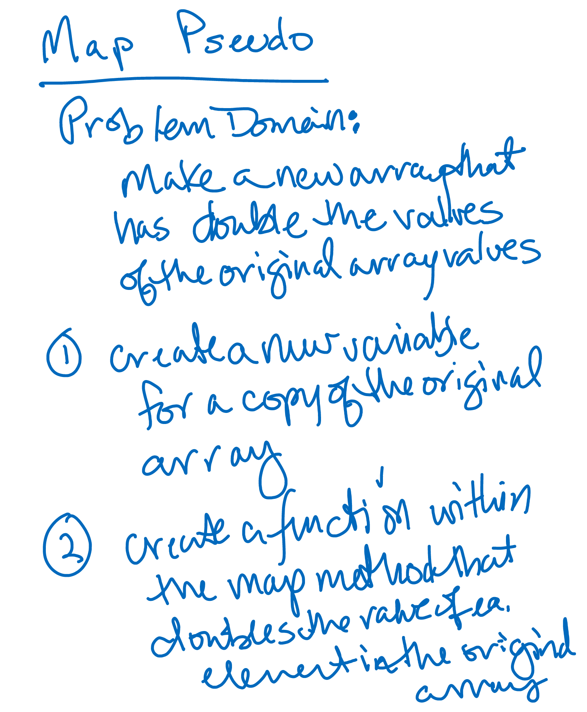

# CodeWars-301
*Map to double - Kata 14 Code 10*

**Link to Kata:** 
https://www.codewars.com/kata/use-map-to-double-the-values-in-an-array/train/javascript

**Problem Domain:** This code is meant to double each value within an array and return a new array with the new values.

**Thought process for solution:**

This time I pseudcoded alone

I based my solution on the class demonstration we did with Vinicio on Friday, covering the map method (higher function) and my REPL notes: https://repl.it/@CodeMaven/MAP-CF301 

**Solution work:**
1. Made solutions.js

2. Made README

3. Wrote the .map method and return in one line because I keep seeing it in katas and I like how elegant it is. 

**Source for image MD code**: http://www.disturbancesinthewash.net/journal/2012/8/11/how-to-add-an-image-with-link-in-markdown.html
