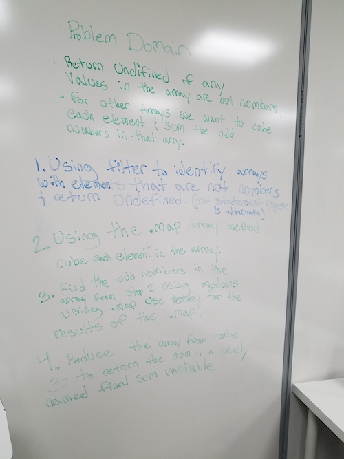

# CodeWars-301
*Sum Odd numbers Cubed - Kata 16 Code 11*

**Link to Kata:** 
https://www.codewars.com/kata/sum-of-odd-cubed-numbers/train/javascript

**Problem Domain:** This code is meant to apply only to arrays without any strings. For those arrays that have only numbers, cube all the numbers then sum only the odd numbers and return the total.

**Thought process for solution:**

This time I pseudcoded with Rebecca

 

**Solution work:**
1. Made solutions.js

2. Made README

3. Wrote the .map.filter.reduce method and return in one line because I keep seeing it in katas and I like how elegant it is. 

4. Researched typeof: https://www.w3schools.com/js/js_datatypes.asp 

5. Consulted with Beverly. Flipped my if else statement

6. Spent an hour flipping statements and trying .every and .each on my undefined if statement and went to bed.

7. Woke up with the idea to try .includes

8. Still didn't work. Consulted with amazing TA Kat and found that my 'undefined' should have been undefined, my if statement with an else was breaking but if alone works and I was filtering even instead of odd numbers. 

9. Fixed!!

**Source for image MD code**: http://www.disturbancesinthewash.net/journal/2012/8/11/how-to-add-an-image-with-link-in-markdown.html
