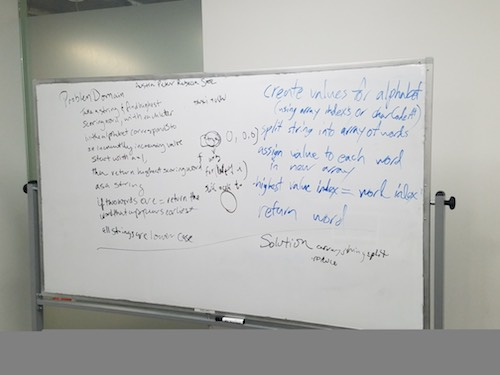

# CodeWars-301
*Highest Scoring Word- Kata 17 Code 12*

**Link to Kata:** 
https://www.codewars.com/kata/highest-scoring-word/train/javascript

**Problem Domain:** To take a string of words and find the highest value word, with each word's value being a sum of each letter's value with a=1 and incrementing on through z=26. There will be no empty strings. And if two words are of equal, highest value, the word that is earliest in the string is to be returned. 

**Thought process for solution:**

This time I pseudcoded with Rebecca, Austin, Peter and Ramon. Mob pseudocode. It was fun, but hard!

 

**Solution work:**
1. Made solutions.js

2. Made README

3. This time, based on today's conversation and coaching from Beverly, I'm just going to try one step at a time and do everything with loops, rather than using higher functions. Assuming I get the solution, I can work to refactor after. 

4. So, it didn't workout last night - I only got one part of many working and it was late, so I called it quits.

5. This evening Austin kindly spent some time talking me through my steps and why each step would or wouldn't work and what I might need to consider. We discussed the CharAt again and the 96 vs. 65 for all letters versus lowercase only. Glad we did.

6. I tried the step by step approach outlined with Austin and got closer (passing some tests but not all).

7. Finally, on a whim, I switched to 96 and it worked!!!

**Source for .split() array method**: https://www.w3schools.com/jsref/jsref_split.asp

**Source for image MD code**: http://www.disturbancesinthewash.net/journal/2012/8/11/how-to-add-an-image-with-link-in-markdown.html
