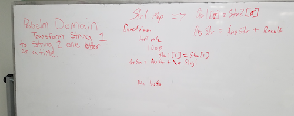

# CodeWars-301
*Highest Scoring Word- Kata 18 Code War 13*

**Link to Kata:** 
https://www.codewars.com/kata/mutate-my-strings

**Problem Domain:** Mutate one string into another string, one letter at a time starting with the first letter, returning each form of the mutation. 

**Thought process for solution:**

This time I pseudcoded with Rebecca, Austin, Kevin and Ramon chimed in at the end. Mob pseudocode. It was fun, but hard! We had a big debate the value of code-like pseduo code vs. just words...

**Solution work:**
1. Made solutions.js

2. Made README

3. This time, based on yesterdays's conversation and coaching from Beverly and Austin, plus a conversation with Brent and Zach, I'm just going to try one step at a time. Assuming I get the solution, I can work to refactor after. 

4. 

**Source for image MD code**: http://www.disturbancesinthewash.net/journal/2012/8/11/how-to-add-an-image-with-link-in-markdown.html

**Source for .replace string method***:
https://www.w3schools.com/jsref/jsref_replace.asp