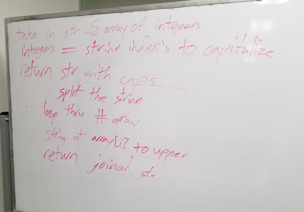

# CodeWars-301
*Highest Scoring Word- Kata 19 Code War 14*

**Link to Kata:** 
https://www.codewars.com/kata/indexed-capitalization

**Problem Domain:** Given a string and an array of integers representing indices, capitalize all letters at the given indices.

**Thought process for solution:**

This time I pseudcoded with Rebecca, Austin and Kevin. Mob pseudocode. It was fun. 

Though, admittedly I felt a bit like Statler or Waldrof at the muppet show. Austin did the writing and I just kept asking questions, like, "Really? can you do that with an array?" "What about the string...let's review the order of steps." 

Then we took pictures and walked away. I went to talk to the instructors and by the time I got back Austin had solved in 5 minutes.

It turns out we missed one key element of a solution in the pseudocode: what if the index numbers are higher than the numbers of characters within a string?

**Solution work:**
1. Made solutions.js

2. Made README

3. Trying the piece by piece approach again.

4. 

**Source for image MD code**: http://www.disturbancesinthewash.net/journal/2012/8/11/how-to-add-an-image-with-link-in-markdown.html

**Source for .replace string method***:
https://www.w3schools.com/jsref/jsref_replace.asp